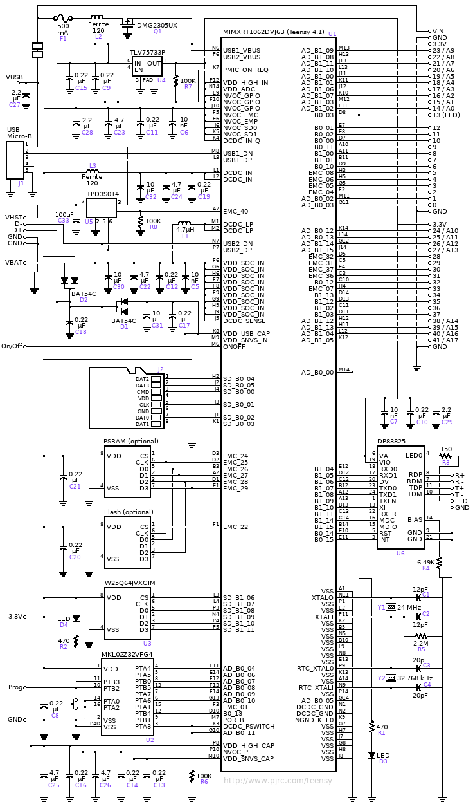

# Biomedical Multi-Sensor DAQ — Teensy 4.1

A collection of embedded firmware projects for the **Teensy 4.1** microcontroller targeting biomedical signal acquisition: ECG, PCG (heart sounds), IMU (seismocardiography), and body temperature. The main project (`ecg_pcg_imu_temp_queued`) synchronously acquires all four signals in real time using multi-threaded firmware.

---

## Hardware

| Component | Part | Interface |
|-----------|------|-----------|
| Microcontroller | Teensy 4.1 | — |
| ECG | MAX30003 | SPI |
| IMU (Accel/Gyro/Mag) | LSM9DS1 | I2C |
| Temperature | MAX30205 | I2C |
| PCG (heart sounds) | Analog microphone | ADC (A2) |

### Board Schematic



### Pin Assignments (`ecg_pcg_imu_temp_queued`)

| Signal | Pin |
|--------|-----|
| I2C SDA | 18 |
| I2C SCL | 19 |
| PCG analog in | A2 (pin 16) |
| ECG CS | 10 |
| ECG MOSI | 11 |
| ECG MISO | 12 |
| ECG SCK | 13 |
| ECG INT | 9 |

---

## Projects

### `ecg_pcg_imu_temp_queued` ← Main project
Multi-sensor DAQ system that simultaneously acquires ECG, PCG, accelerometer, and temperature data and streams them over USB serial in a structured CSV format.

**Two iterations:**
- `v1/` — uses the [Filters](https://github.com/JonHub/Filters) library for PCG low-pass filtering
- `v2/` — replaces it with a self-contained `SimpleLowPassFilter` class (no extra dependency), and uses a cleaner ECG sensor API

### `pcg_recorder`
Standalone PCG (phonocardiogram) recorder. Captures heart sounds from an analog microphone, applies a bandpass filter (80 Hz), and writes a `.WAV` file to the onboard SD card using the [Teensy Audio library](https://www.pjrc.com/teensy/td_libs_Audio.html). Stops after 10 seconds and finalizes the WAV header.

### `temp_max30205`
Minimal sketch to read body temperature from the MAX30205 sensor over I2C and print it to the serial monitor at 10 Hz.

### `accelerometer_test`
Reads the Z-axis of the LSM9DS1 IMU at 100 Hz and prints to serial. Z-axis is used for SCG (seismocardiography — detecting cardiac vibrations through the chest wall).

---

## Dependencies

Install these libraries via the Arduino Library Manager or manually:

| Library | Source |
|---------|--------|
| TeensyThreads | https://github.com/ftrias/TeensyThreads |
| SparkFun LSM9DS1 | Arduino Library Manager → "SparkFun LSM9DS1" |
| Protocentral MAX30205 | https://github.com/Protocentral/protocentral_max30205 |
| protocentral MAX30003 | https://github.com/Protocentral/protocentral_max30003 |
| Filters *(v1 only)* | https://github.com/JonHub/Filters |
| Teensy Audio *(pcg_recorder only)* | Bundled with Teensyduino |
| Adafruit LSM9DS1 *(accelerometer_test only)* | Arduino Library Manager → "Adafruit LSM9DS1" |

> **Note:** `Protocentral_MAX30205.h` is included directly in the sketch folders — no separate installation needed for that one.

---

## Setup

1. Install [Teensyduino](https://www.pjrc.com/teensy/td_download.html) (Arduino + Teensy add-on)
2. Install all required libraries listed above
3. Open the desired `.ino` file in the Arduino IDE
4. Set **Tools → Board → Teensy 4.1**
5. Set **Tools → USB Type → Serial**
6. Upload

---

## Usage — `ecg_pcg_imu_temp_queued`

Open the Serial Monitor at **115200 baud**. On startup, the firmware validates all sensors. If all pass, five acquisition threads start and data streams immediately:

```
========================================
Multi-Sensor Data Acquisition System
Teensy 4.1 - Medical Sensor Array
========================================

========== SENSOR VALIDATION ==========
Validating PCG... OK
Validating LSM9DS1 Accelerometer... OK
Validating MAX30205 Temperature... OK (36.78°C)
Validating MAX30003 ECG... OK
=======================================

✓✓✓ ALL SYSTEMS OPERATIONAL ✓✓✓
Data format: SENSOR,TIMESTAMP,VALUE(S)

PCG,1023,42
ACCEL,1023,0.0021,0.0013,9.8034
ECG,1024,-128
TEMP,2000,36.78
...
```

### Data Format

| Sensor | Format | Sample Rate |
|--------|--------|-------------|
| PCG | `PCG,<timestamp_ms>,<value>` | 1000 Hz |
| Accelerometer | `ACCEL,<timestamp_ms>,<x>,<y>,<z>` | 1000 Hz |
| ECG | `ECG,<timestamp_ms>,<value>` | 125 Hz |
| Temperature | `TEMP,<timestamp_ms>,<celsius>` | 1 Hz |

### Fault Handling

A watchdog runs every second and checks that each sensor produced data within the last 5 seconds. If any sensor stops responding, the system halts and flashes the LED rapidly. Restart the device to recover.

---

## Architecture (`ecg_pcg_imu_temp_queued`)

```
masterTimer (1 kHz IntervalTimer ISR)
    │
    ├── pcgThread    — ADC read → lowpass filter → queue (1 kHz)
    ├── accelThread  — I2C read → queue (1 kHz)
    ├── tempThread   — I2C read → queue (1 Hz)
    ├── ecgThread    — SPI read → queue (125 Hz)
    └── outputThread — drain all queues → Serial + watchdog check
```

All queues are mutex-protected (`Threads::Mutex`). Each queue is capped to prevent unbounded growth if the output thread falls behind.

---

## License

MIT
